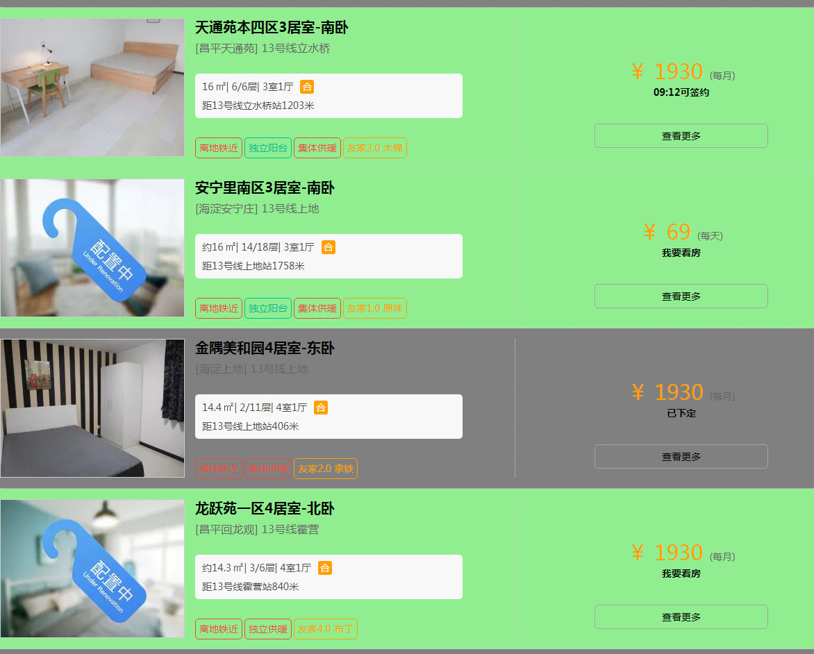

# Enhanced Ziroom

这是一个增强自如官网访问体验的 userscript 。

自如官网现在搜索到的结果，把可以租的可以看的不能租的不能看的都混到一起了。大量的无效结果混扎在搜索结果中，用户必须点开每个房源的详情页才能确认房子是否有效，非常浪费用户时间。

这个插件可以在列表页就显示房源的状态，并用颜色标记出来。

## 截图

## 使用说明

### 安装

请首先安装 Userscript manager。谷歌浏览器可以：

- 安装 **暴力猴 扩展程序**：[谷歌商店链接](https://chrome.google.com/webstore/detail/violentmonkey/jinjaccalgkegednnccohejagnlnfdag)，[GitHub链接](https://github.com/violentmonkey/violentmonkey/releases/latest)
- 或安装 **Tampermonkey** ：[谷歌商店链接](https://chrome.google.com/webstore/detail/tampermonkey/dhdgffkkebhmkfjojejmpbldmpobfkfo)

火狐浏览器同样支持

- 或 **Tampermonkey** ，[Firefox 附加组件](https://addons.mozilla.org/zh-CN/firefox/addon/tampermonkey/)
- 或安装 **暴力猴 扩展程序**，[Firefox 附加组件](https://addons.mozilla.org/zh-CN/firefox/addon/violentmonkey/)

之后安装 Enhanced Ziroom：

- 脚本安装地址：<https://greasyfork.org/zh-CN/scripts/36468-enhanced-ziroom>，点击页面上的 **安装此脚本** 即可。

注：其他浏览器未经过详细测试，如有问题请反馈。

### 使用

脚本仅在列表页生效。

有效房源标记为绿色，提示文字为 **我要看房** ，此类包括 **配置中**，**可预定**，以及 **现房**。对于刚刚放出但尚未开放看房或预定的，则会显示 **可签约时间**。

无效房源标记为灰色，提示文字为 **已下定**，此类包括......我不知道，传闻是不看房也不签约直接订房的人弄的。

提示文字都是在详情页固定位置抠的。

## 原理

自如并未提供过任何 API 接口。所以为了获取这些信息，脚本会从列表页中扫描所有详情页地址，并全部扫一遍。脚本会对每个房源都发一条HTTP请求，按理来讲还是有点消耗带宽的。

房源状态判断以及提示文字也都是在详情页固定位置抠的。

也说了，都是扣的页面，也没有 API ，所以也随时会失效。

## 源码

Github：<https://github.com/catscarlet/enhanced_ziroom>

master分支用于发布。如有 Pull request 请发到 dev 分支。

## LICENSE

**Apache License 2.0**
